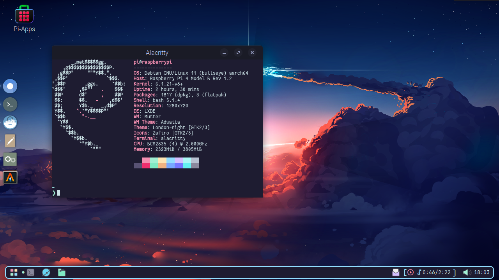
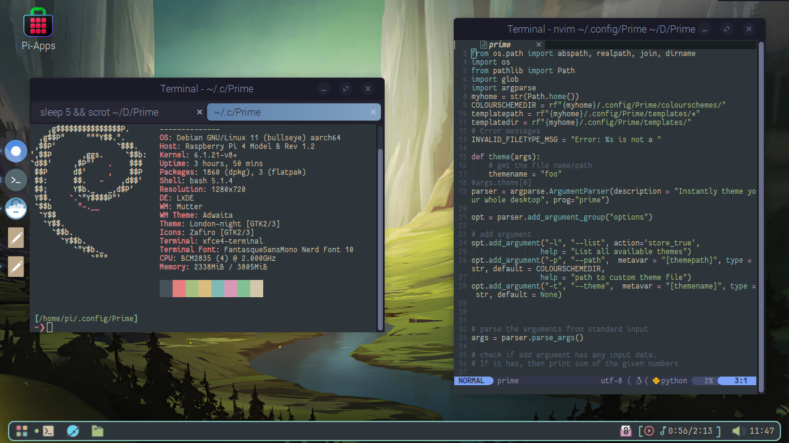
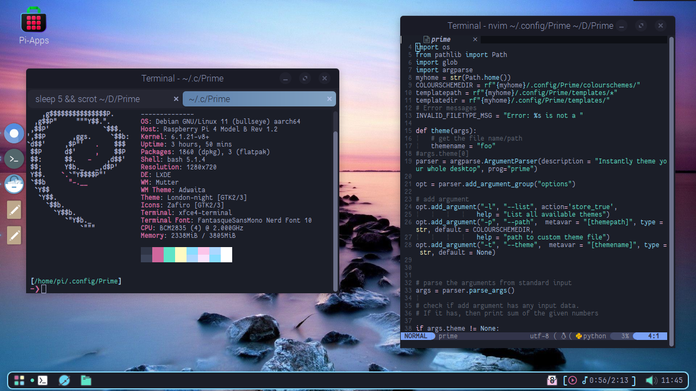
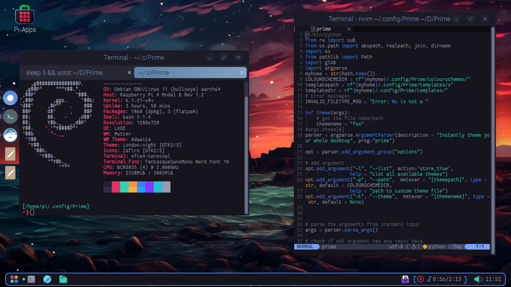

# Prime
Universal themer for Linux programs.
Set themes from a large collection of `.bash` colourschemes.
___

 
___

> **Note:** Prime is does not create themes based off images (see [pywal](https://github.com/dylanaraps/pywal)) but from colourscheme files.
## **Usage**

`prime -l #List available colourschemes`   
`prime -t <THEME_NAME> #Set chosen theme`   
`prime -t $(prime -l | rofi -dmenu)`   

## **Installation**

```
git clone https://github.com/ItsTerm1n4l/Prime.git   
cd ./Prime   
./install.sh   
```
## **Info**

Theming is managed using templates, I have already created some and included them in the repo but this program is designed to be expanded and have many more templates added.   
If you create any templates please create an issue and paste it there or create a pull request and I can add it to the repo.    
### **Here is a quick guide to how the templates work.**
The name of the template is the path to the theme file of the program you want to theme   
but forwardslashes are replaced with backslashes, in the template file is the code for the theming of the program,   
Here is an example using Alacritty.       
 
The hex values are replaced with placeholders for `prime` which reads them and inserts the correct colour and puts the     
output file in the directory set in the file name, for alacritty the template name would be `\.config\alacritty\colours.yml`.   
>**Note:**  These names start from the `$HOME` directory.

This method using templates means that more programs can easily be added and themed so please do.   
Thank you!   
### **Gallery**
<details>
<summary>(Click to expand)</summary>

Embark theme.   


Everforest theme.   


Poimandres theme.   


Monokai theme.   


</details>

### **Included Themes**
 
>Catppuccin-frappe  
>Catppuccin-latte  
>Catppuccin-macchiato  
>Catppuccin-mocha    
>Challenger-deep    
>Dracula  
>Embark  
>Everforest  
>Gruvbox  
>Gruvbox-material  
>Kanagawa-storm  
>Kanagawa-wave  
>Monokai  
>Moonlight    
>Nord   
>Nordic-night  
>Poimandres  
>Pastel    
>Rose-pine    
>Rose-pine-dawn   
>Rose-pine-moon   
>Tokyo-night   
>Tokyo-storm   

Thanks:   
https://github.com/alacritty/alacritty-theme    
https://github.com/sainnhe      
https://github.com/adi1090x and his awesome https://github.com/archcraft-os for inspiring me to make this!    
